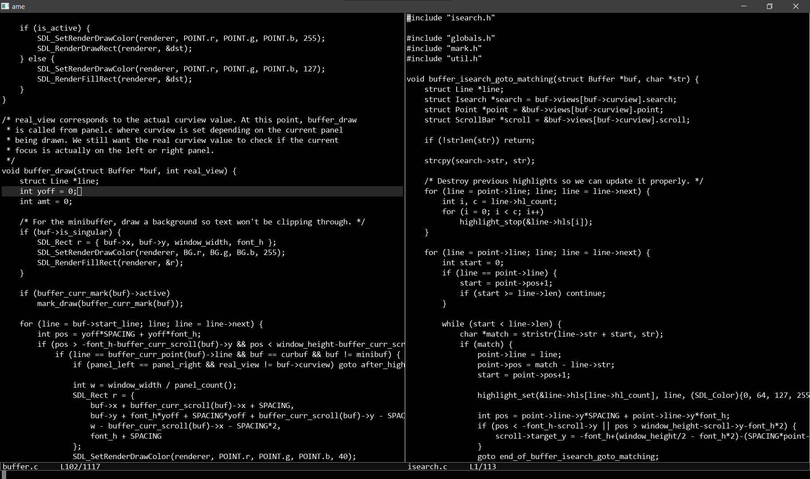

# ame - A text editor written in notepad.

Ame is a text editor written without using any normal IDE or text editor, but with
MS notepad on Windows 10 over a total of 41 hours. I'll soon be uploading a timelapse
of the entire development which I recorded.

# Screenshots

# Features

Ame has a decent amount of features, only lacking undo/redo.
Aside from the obvious required features such as opening files, ame has:

1. An emacs-like minibuffer where interactions occur.
2. Different buffers: Ctrl+TAB or Ctrl+B between them.
3. Panels; even opening the same buffer in both panels.
4. Find/replace; two versions- Query and Non-query.
5. Isearch via Ctrl+F, very similar to emacs.
6. Selection.
7. Works with files either using tabs or spaces.
8. Cycling autocomplete via TAB when opening a file or switching buffers.

# All Key Bindings

| Key | Action |
| ----------- | ----------- |
| Return / Ctrl+M | New line or Accept |
| Tab | Insert 4 spaces or '\t' |
| Ctrl+Tab | Switch to next buffer |
| Ctrl+Space | Set mark |
| Ctrl+G | Escape from anything |
| Ctrl+U | Switch to other panel |
| Alt+A | Remove other panel |
| Ctrl+E | Remove current panel |
| Ctrl+A | Select all |
| Ctrl+C | Copy |
| Ctrl+X | Cut |
| Ctrl+V | Paste |
| Ctrl+Q | Query Replace |
| Ctrl+H | Replace All |
| Up/Down/Left/Right | Move cursor |
| Ctrl + Up/Down/Left/Right | Move by block/word |
| Home | Beginning of line |
| End | End of line |
| Ctrl+O | Open File |
| Ctrl+F | Find |
| Ctrl+S | Save buffer |
| Ctrl+B | Switch to buffer |
| Ctrl+Shift+K | Kill buffer |
| Ctrl+W | Kill current buffer |
